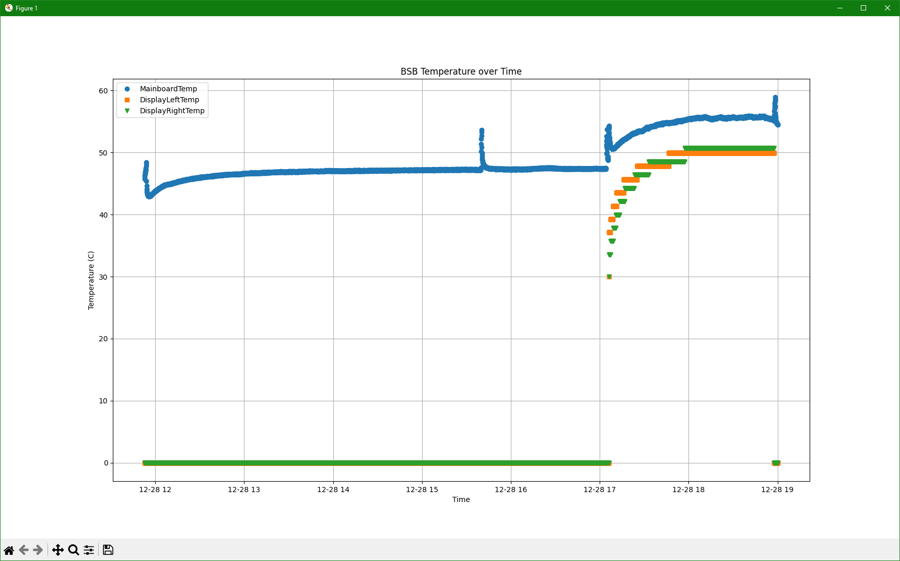

# bigscreen-temp-monitor
View your Bigscreen Beyond VR headset's temperatures over time in a nice interactive GUI window. Primarily intended for real-time monitoring, but also works with historical data. 



## Setup

Requires a recent version of Python3. Only tested on Windows, but should work on any OS as long as you specify the right logfile path. 

```bash
pip install -r requirements.txt
```

## Usage

```bash
usage: tempMonitor.py [-h] [--logfile LOGFILE] [--lastHours LASTHOURS] [--lastMinutes LASTMINUTES]
                      [--lastSeconds LASTSECONDS] [--startTime STARTTIME] [--endTime ENDTIME]

Monitor BSB headset temperature from log file.

options:
  -h, --help            show this help message and exit
  --logfile LOGFILE, -f LOGFILE
                        Path to the log file. Default is 'C:\Program Files (x86)\Steam\steamapps\common\Bigscreen
                        Beyond Driver\bin\log.txt'
  --lastHours LASTHOURS, -H LASTHOURS
                        Show this many previous hours of data. Will be added to other --lastX arguments
  --lastMinutes LASTMINUTES, -M LASTMINUTES
                        Show this many previous minutes of data. Will be added to other --lastX arguments
  --lastSeconds LASTSECONDS, -S LASTSECONDS
                        Show this many previous seconds of data. Will be added to other --lastX arguments
  --startTime STARTTIME, -s STARTTIME
                        Show data starting from this time. Not compatible with --lastX arguments. Format: 'YYYY-MM-DD
                        HH:MM:SS' or 'HH:MM:SS' (assume today's date).
  --endTime ENDTIME, -e ENDTIME
                        Show data ending at this time. Not compatible with --lastX arguments. Format: 'YYYY-MM-DD
                        HH:MM:SS' or 'HH:MM:SS' (assume today's date).
```

### Examples

Monitor the default log file in real time, showing the last 1.5 hours of rolling data:
```bash
tempMonitor.py -H 1 -M 30
```

Monitor the default log file in real time, starting from 1:30pm local time on today's date:
```bash
tempMonitor.py -s 13:30:00
```

Show data from a saved log file starting at a particular date and time, until the end of the log file:
```bash
tempMonitor.py -f ./savedLog.txt -s '2026-01-05 13:30:00'
```
